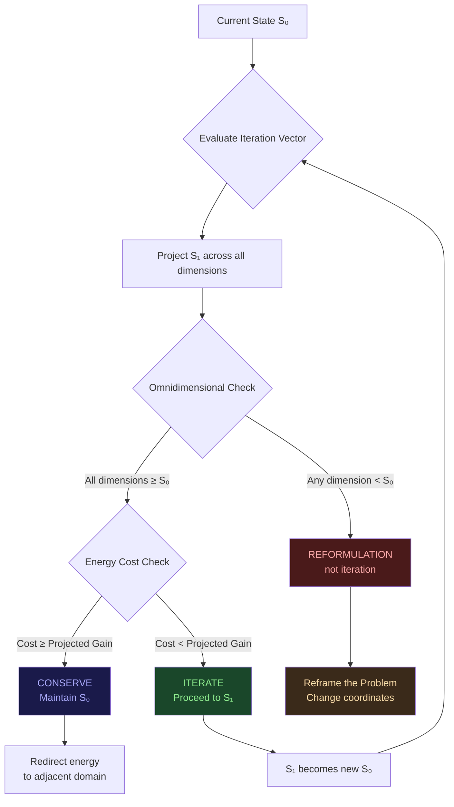
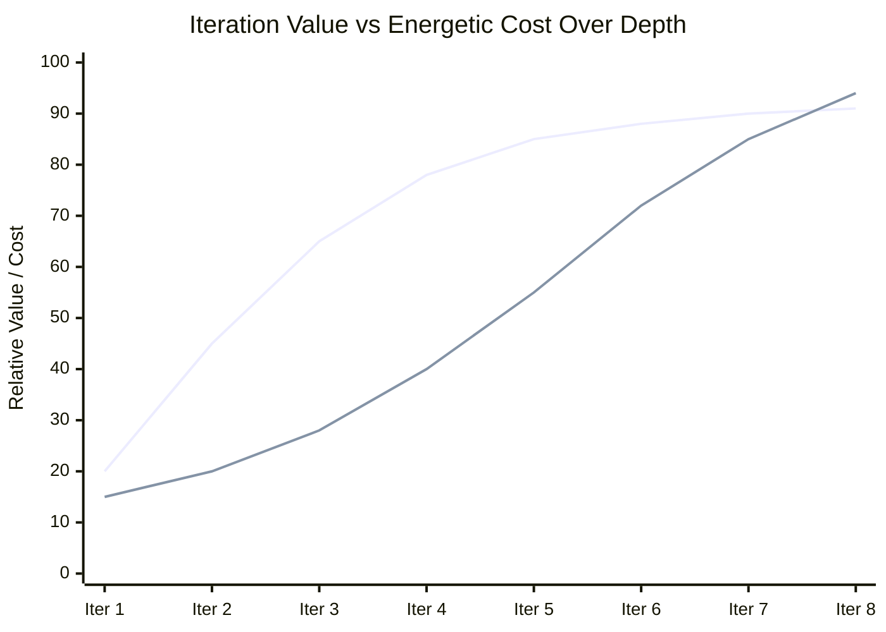
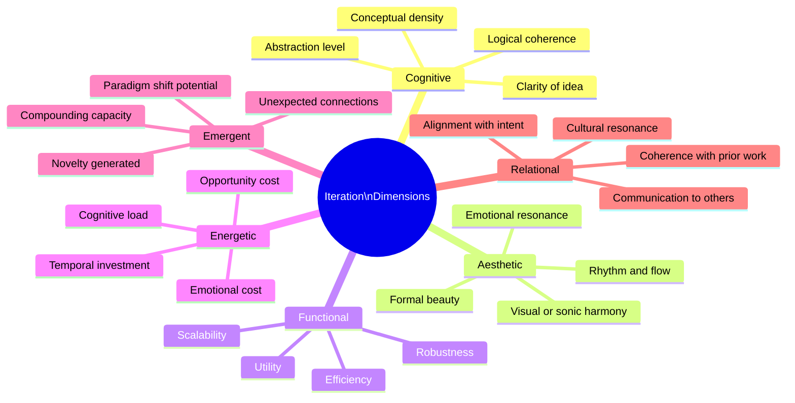
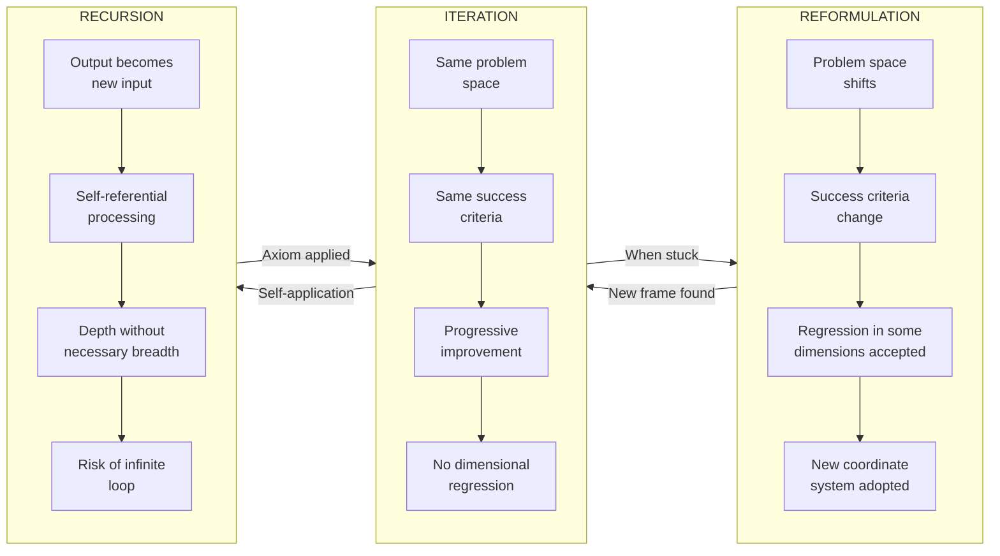
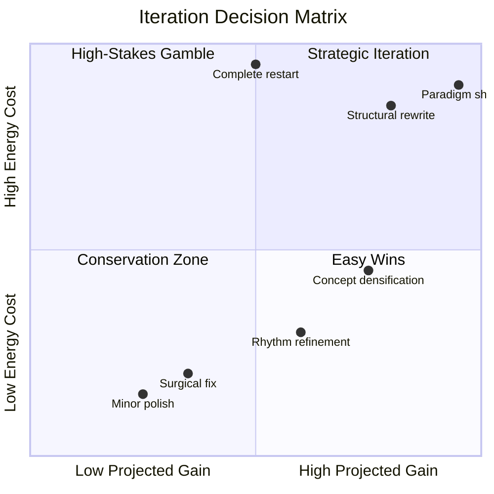
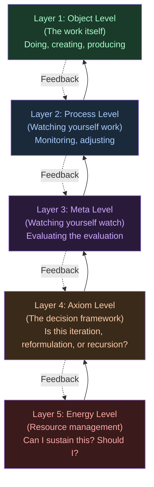
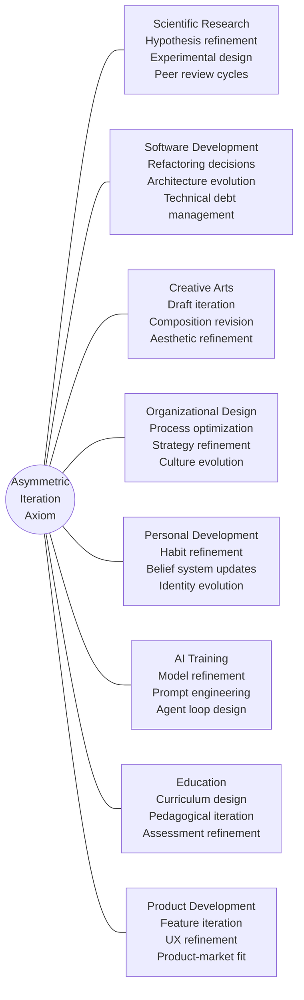
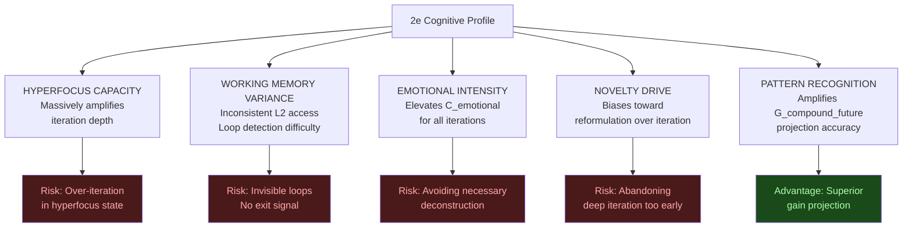
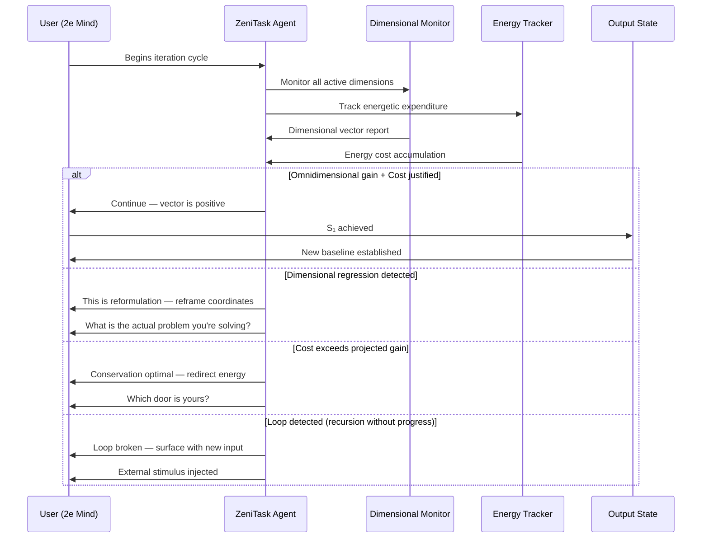
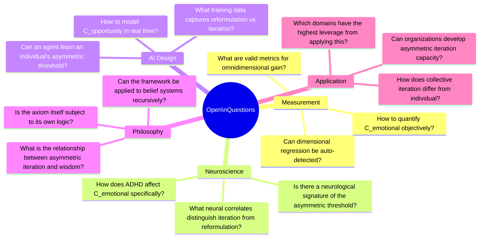

Zenitask omnidirectional iteration Framework 001 MD
# The Asymmetric Iteration Axiom

## A Framework for Omnidimensional Recursive Refinement

> *“Iterations are unlimited — but the only valid condition to continue is that the energetic cost of deconstructing and reconstructing a portion is less than leaving it as is, OR that the iteration is omnidimensionally equal or greater — without regression. If there is regression in any area, it is reformulation, not iteration.”*
> — Foundational Axiom, ZeniTask Framework

-----

## Table of Contents

1. [Core Premise](#core-premise)
2. [The Asymmetry Principle](#the-asymmetry-principle)
3. [Dimensional Architecture](#dimensional-architecture)
4. [The Iteration-Reformulation Distinction](#the-iteration-reformulation-distinction)
5. [Energetic Cost Model](#energetic-cost-model)
6. [The Metacognitive Stack](#the-metacognitive-stack)
7. [Application Domains](#application-domains)
8. [The 2e Connection](#the-2e-connection)
9. [ZeniTask as Asymmetry Arbiter](#zenitask-as-asymmetry-arbiter)
10. [Literature Connections](#literature-connections)
11. [Open Questions](#open-questions)

-----

## 1. Core Premise

Most frameworks for creative and cognitive refinement assume that iteration is inherently virtuous — that more cycles always produce better outcomes. This assumption is **incomplete and energetically naive.**

The Asymmetric Iteration Axiom proposes instead that:

- Iterations are theoretically unlimited
- But each iteration carries a **real energetic cost** — cognitive, emotional, temporal
- The decision to iterate is therefore not binary (iterate / don’t iterate) but **thermodynamic** (is the projected gain worth the total cost of deconstruction + reconstruction?)
- Regression in any dimension disqualifies the cycle as iteration — it is categorially **reformulation**



-----

## 2. The Asymmetry Principle

The term *asymmetric* refers to the fundamental imbalance between:

|Side A — Cost of Iteration              |Side B — Gain of Iteration           |
|----------------------------------------|-------------------------------------|
|Energetic cost of deconstruction        |Quality improvement in output        |
|Emotional cost of destroying what worked|New dimensional unlocks              |
|Temporal cost of reconstruction         |Compounding future iteration capacity|
|Opportunity cost of not advancing       |Signal clarity increase              |
|Cognitive load of holding two states    |Reduced future friction              |

The asymmetry is not static. It shifts based on:

- **Phase of the work** — early iterations have lower destruction cost; late iterations have higher stakes
- **Cognitive state of the operator** — exhaustion raises all costs asymmetrically
- **Proximity to insight threshold** — just before a breakthrough, the gain side spikes dramatically
- **Accumulated iteration depth** — deep refinement compounds; shallow refinement plateaus



*When the cost line crosses the value line — conservation or redirection is optimal.*

-----

## 3. Dimensional Architecture

What does “omnidimensional” mean operationally? The following framework identifies the primary dimensions across which iteration must be evaluated:



**The omnidimensional check requires that S₁ ≥ S₀ across ALL active dimensions, not just the primary one.**

This is why surgical critique is essential — you must identify which dimensions improved, which regressed, and whether the regression represents true loss or dimensional trade that enables superior gain elsewhere.

-----

## 4. The Iteration-Reformulation Distinction

This is the most undertheorized distinction in creative and cognitive practice.



### Why the distinction matters

Calling reformulation “iteration” creates:

- False sense of progress metrics
- Inability to recognize when you’ve changed the goal
- Confusion between evolution and revolution
- Wasted energy comparing incomparable states

Calling iteration “reformulation” creates:

- Premature abandonment of viable paths
- Underestimation of compounding returns
- Loss of accumulated depth
- Scattered rather than deepening work

-----

## 5. Energetic Cost Model

The total cost of any iteration attempt can be modeled as:

```
C_total = C_destruct + C_reconstruct + C_emotional + C_opportunity + C_cognitive_load
```

Where:

|Variable        |Description                                        |Key Modifiers                     |
|----------------|---------------------------------------------------|----------------------------------|
|C_destruct      |Cost of dismantling current state                  |Attachment level, investment depth|
|C_reconstruct   |Cost of building S₁                                |Complexity, novelty required      |
|C_emotional     |Grief of destroying what worked                    |Identity fusion with work         |
|C_opportunity   |Value of alternative uses of energy                |Available paths, urgency          |
|C_cognitive_load|Mental overhead of holding S₀ and S₁ simultaneously|Working memory capacity           |

And the projected gain:

```
G_total = G_quality + G_dimensional_unlock + G_compound_future + G_signal_clarity
```

**The Asymmetric Threshold:**

```
Iterate IF: G_total > C_total × (1 + uncertainty_factor)
```

The uncertainty factor accounts for the fact that G_total is projected, not certain — and projection error is itself an energetic cost.



-----

## 6. The Metacognitive Stack

The capacity for asymmetric iteration requires a specific stack of metacognitive capabilities operating in concert:



**Most people operate at L1-L2. Asymmetric iteration requires voluntary, fluid access to all five layers simultaneously.**

The 2e profile (ADHD + high ability) characteristically has exceptional L1 and L3 capacity — extraordinary output and extraordinary meta-awareness — but dysregulated L2 and L5, which creates the characteristic paradox: brilliant work that is difficult to sustain and direct.

-----

## 7. Application Domains

The Asymmetric Iteration Axiom is not domain-specific. Its application is **pivotal** in the following fields:



### Where it is most pivotal:

**1. AI Agent Loop Design** — Every agentic system is fundamentally an iteration engine. The asymmetric axiom directly governs when an agent should retry, reformulate, or conserve compute.

**2. Scientific Method** — The decision to run another experiment vs. reformulate the hypothesis is exactly the asymmetric calculation. Most research waste comes from iterating when reformulation was needed.

**3. Personal Identity Evolution** — Belief updating is the most emotionally costly form of iteration. The asymmetric axiom explains why people resist changing beliefs that are clearly suboptimal — the C_emotional is genuinely high.

**4. Creative Mastery** — The difference between an amateur and a master is largely the calibration of the asymmetric threshold. Masters know when a work is done. Amateurs over-iterate (destroying) or under-iterate (settling).

-----

## 8. The 2e Connection

The twice-exceptional (2e) profile — high ability + ADHD — creates a specific distortion in the asymmetric calculation:



**The 2e paradox:** The same profile that enables extraordinary iteration depth also dysregulates the mechanisms that know when to stop, redirect, or conserve.

This is not a deficit. It is an **asymmetric profile** that requires asymmetric tools.

-----

## 9. ZeniTask as Asymmetry Arbiter

The core function of ZeniTask, reframed through the axiom:



**ZeniTask is not a productivity app.**

It is an **external metacognitive layer** — a prosthetic for the asymmetric calculation that the 2e mind performs brilliantly in theory and inconsistently in practice due to the distortions catalogued above.

-----

## 10. Literature Connections

The Asymmetric Iteration Axiom connects to and extends several established frameworks:

|Framework                           |Author/Field           |Connection                      |Extension                                                  |
|------------------------------------|-----------------------|--------------------------------|-----------------------------------------------------------|
|**Deliberate Practice**             |Ericsson (1993)        |Focused iteration with feedback |Adds energetic cost dimension and regression taxonomy      |
|**Kahneman’s System 1/2**           |Kahneman (2011)        |Fast/slow thinking costs        |Explains C_cognitive_load asymmetry in iteration           |
|**Csikszentmihalyi’s Flow**         |Csikszentmihalyi (1990)|Optimal challenge-skill ratio   |Flow as the state where iteration cost is minimized        |
|**Kolb’s Learning Cycle**           |Kolb (1984)            |Experiential iteration loop     |Adds termination conditions and dimensional evaluation     |
|**Popper’s Falsificationism**       |Popper (1959)          |Scientific iteration framework  |Adds energetic justification for when to falsify vs. refine|
|**Hofstadter’s Strange Loops**      |Hofstadter (1979)      |Self-referential recursion      |Distinguishes productive from pathological recursion       |
|**Thagard’s Conceptual Revolutions**|Thagard (1992)         |Reformulation in science        |Validates iteration/reformulation distinction              |
|**Polyvagal Theory**                |Porges (1994)          |Autonomic cost of cognitive work|Biological basis for C_emotional in iteration              |
|**Vygotsky’s ZPD**                  |Vygotsky (1978)        |Optimal iteration zone          |Zone where cost/gain ratio is most favorable               |

### The Gap in the Literature

No existing framework simultaneously addresses:

1. The **energetic threshold** for when to iterate
2. The **categorical distinction** between iteration, reformulation, and recursion
3. The **dimensional omnidirectionality** requirement for true iteration
4. The **specific distortions** introduced by neurodivergent cognitive profiles
5. The **agent design implications** for AI systems that support human iteration

**This axiom fills that gap.**

-----

## 11. Open Questions

The framework raises several productive research questions:



-----

## Appendix: Notation Summary

|Symbol       |Meaning                                        |
|-------------|-----------------------------------------------|
|S₀           |Current state before iteration                 |
|S₁           |Projected state after iteration                |
|C_total      |Total energetic cost of iteration attempt      |
|G_total      |Total projected gain from iteration            |
|C_destruct   |Cost of dismantling current state              |
|C_emotional  |Emotional cost of destroying working elements  |
|C_opportunity|Value of alternative uses of energy            |
|G_compound   |Compounding gain from deeper iteration capacity|
|Δ_dim        |Delta across a specific dimension              |
|∀_dim        |For all active dimensions                      |

-----

*ZeniTask Framework v0.1 — Foundational Document*
*From chaos to your peak.*