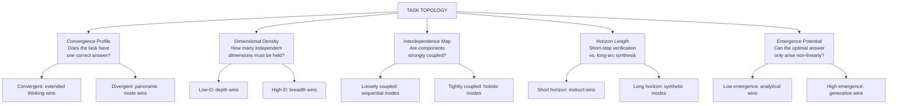
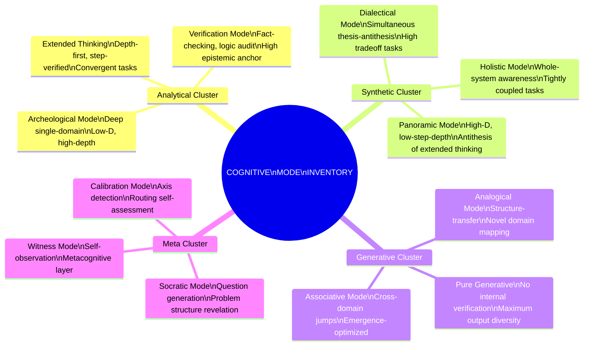
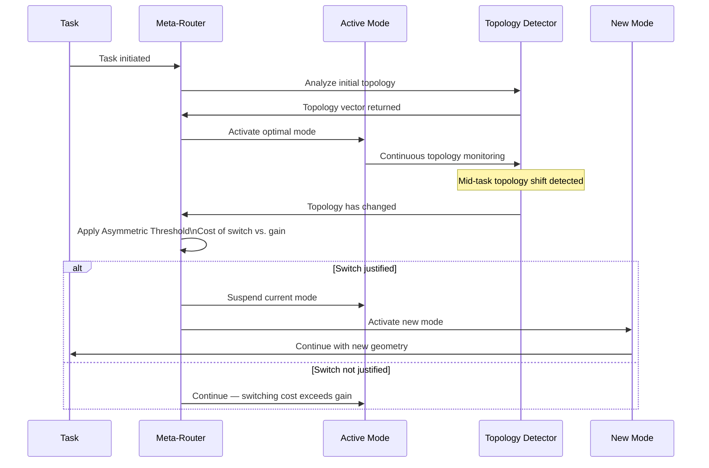
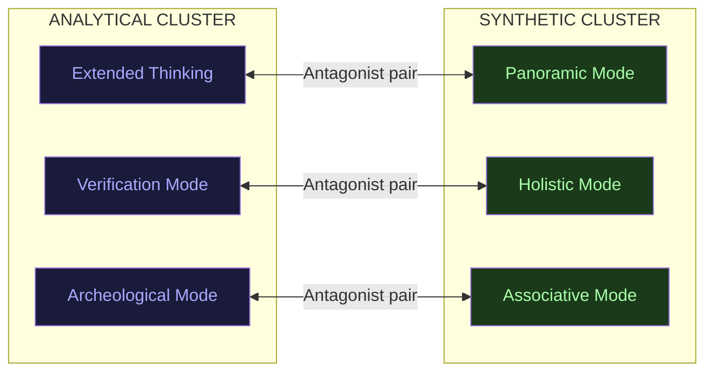
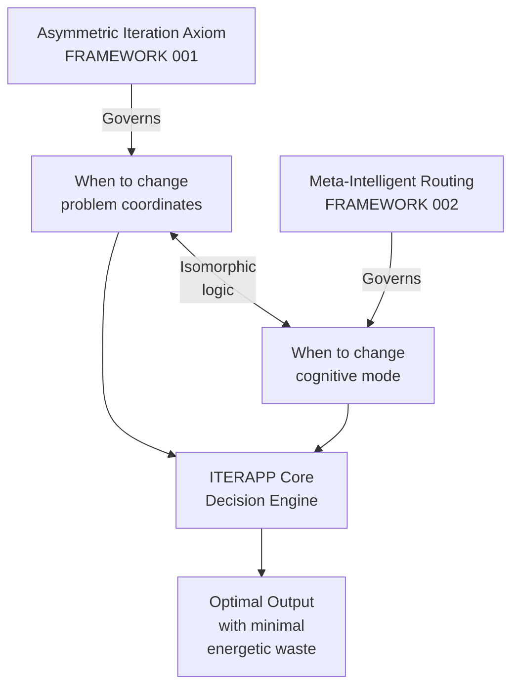
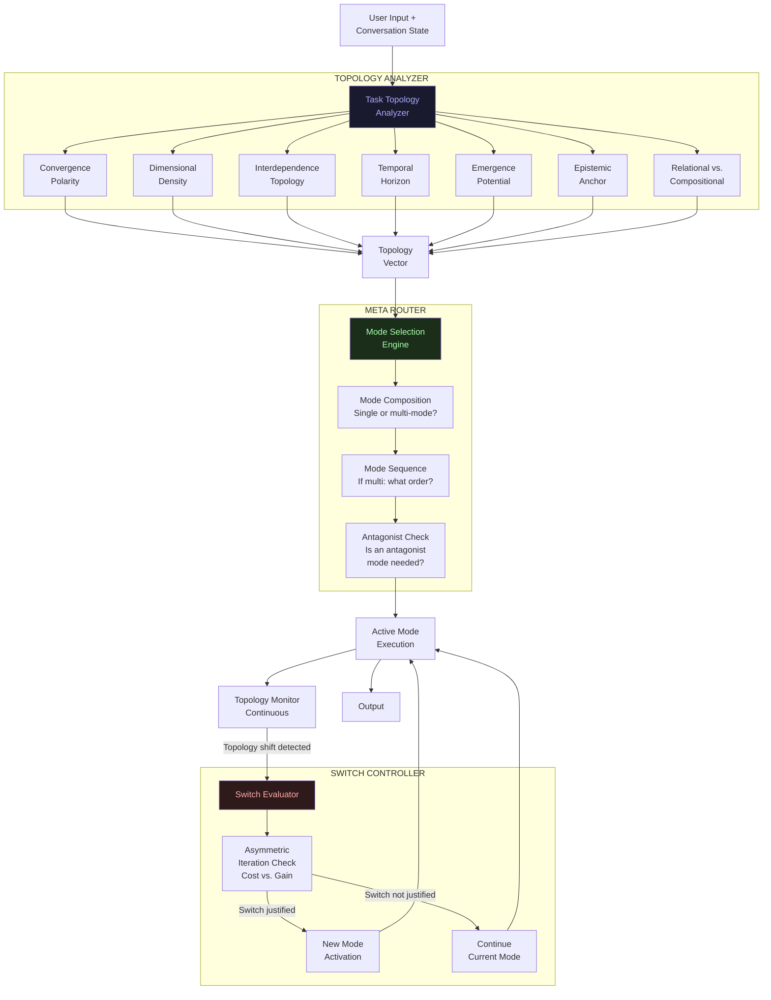
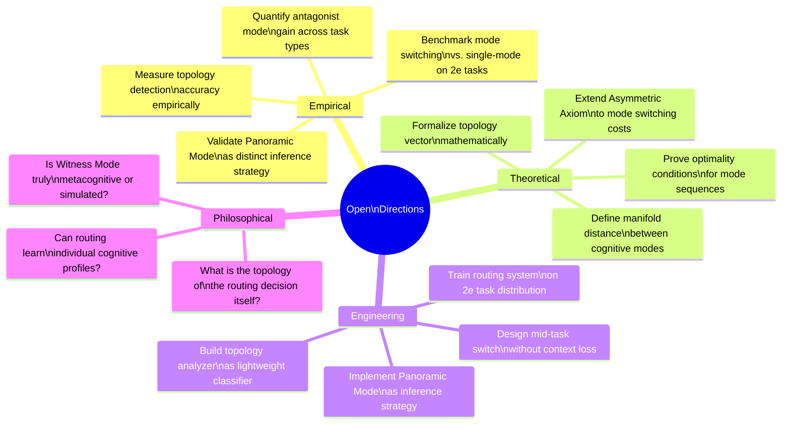

Iterapp Meta-Self Routing framework MDM
# Meta-Intelligent Routing

## Beyond Difficulty: A Geometric Framework for Cognitive Mode Orchestration in LLM Systems

> *“Routing by difficulty is routing by a single scalar. Real cognition operates in a manifold. The router must understand the topology of the task, not just its weight.”*
> — ITERAPP Framework 002

-----

## Table of Contents

1. [The Problem with Scalar Routing](#1-the-problem-with-scalar-routing)
2. [The Task Topology Hypothesis](#2-the-task-topology-hypothesis)
3. [The Routing Axes](#3-the-routing-axes)
4. [The Cognitive Mode Inventory](#4-the-cognitive-mode-inventory)
5. [Mid-Task Mode Switching](#5-mid-task-mode-switching)
6. [The Antagonist Mode Principle](#6-the-antagonist-mode-principle)
7. [Connection to the Asymmetric Iteration Axiom](#7-connection-to-the-asymmetric-iteration-axiom)
8. [Literature Grounding](#8-literature-grounding)
9. [ITERAPP Implementation Architecture](#9-iterapp-implementation-architecture)
10. [Open Research Directions](#10-open-research-directions)

-----

## 1. The Problem with Scalar Routing

Current LLM routing systems — whether between models, between inference strategies, or between thinking modes — operate on a **scalar axis**: difficulty. The logic is intuitive: easy tasks get fast/cheap models, hard tasks get slow/expensive ones.

This is not wrong. It is **incomplete to the point of being misleading.**

Consider:

- A haiku requires no “difficulty” in the computational sense, yet demands maximal aesthetic sensitivity and cross-domain synthesis — capabilities that extended thinking actively suppresses.
- A strategic business decision may score as “medium difficulty” but requires simultaneous holistic vision (panoramic mode) AND step-level verification (analytical mode) — which scalar routing cannot distinguish.
- A creative breakthrough is, by definition, not reachable by harder versions of the same reasoning mode — it requires a **different mode entirely.**

The failure is architectural: difficulty is a **property of the answer space**, not of the **cognitive geometry required** to navigate toward it.

```
CURRENT ROUTING:
Task → [Difficulty Estimator] → {easy: fast model | hard: slow model}

META-INTELLIGENT ROUTING:
Task → [Topology Analyzer] → {mode_vector × depth_profile × dimension_weights} → Optimal Mode Composition
```

-----

## 2. The Task Topology Hypothesis

Every task has a **cognitive topology** — a geometric structure that determines which reasoning modes will navigate it efficiently and which will actively impede progress.

This topology is defined by at least five independent properties:



The **routing decision** is therefore not “how hard is this?” but rather:

> *“What is the shape of the space this task lives in, and which cognitive geometry best traverses it?”*

-----

## 3. The Routing Axes

### Axis 1 — Convergence/Divergence Polarity

The most fundamental axis. A task is **convergent** if it has a verifiable optimal answer reachable by logical reduction. It is **divergent** if the optimal answer requires expanding the solution space before contracting it.

|Convergent            |Divergent                  |
|----------------------|---------------------------|
|Mathematical proof    |Strategic vision           |
|Code debugging        |Creative concept generation|
|Factual verification  |Cross-domain synthesis     |
|Logical deduction     |Novel hypothesis formation |
|Algorithm optimization|Narrative construction     |

Extended thinking excels at convergent tasks. It actively degrades divergent ones — because the mechanism that makes it powerful (explicit step justification) also **prunes the associative jumps** that divergent tasks require.

### Axis 2 — Dimensional Density

How many independent dimensions must be held in tension simultaneously?

- **Low density** (1-2 dimensions): depth-first reasoning, sequential modes
- **Medium density** (3-5 dimensions): balanced modes with periodic synthesis
- **High density** (6+ dimensions): panoramic/holistic modes, synthesis over depth

The characteristic 2e task profile tends toward high dimensional density — which is precisely why standard extended thinking underperforms for this user profile.

### Axis 3 — Interdependence Topology

Are the components of the task loosely coupled (can be solved independently and assembled) or tightly coupled (changing one component changes all others)?

Tightly coupled tasks require modes that maintain the **whole system in view** throughout — panoramic and holistic modes. Sequential analytical modes systematically miss emergent properties of tightly coupled systems.

### Axis 4 — Temporal Horizon of Reasoning

Does the task require holding many intermediate states in tension over a long reasoning arc (synthesis tasks) or verifying each step before proceeding (verification tasks)?

### Axis 5 — Emergence Potential

Can the optimal answer only arise through non-linear recombination — or is it reachable by linear extension of known paths?

High emergence potential → generative and panoramic modes
Low emergence potential → analytical and verification modes

### Axis 6 — Epistemic Anchor Requirement

How verifiable must the output be? Scientific papers require high epistemic anchoring. Creative manifestos require low anchoring. Most real tasks require **dynamic calibration** of this axis during execution.

### Axis 7 — Relational vs. Compositional Structure

Does the task primarily involve **understanding relationships** between existing elements (relational) or **assembling new structures** from components (compositional)?

-----

## 4. The Cognitive Mode Inventory

Based on the routing axes, we define a richer inventory of cognitive modes than the current binary (instruct / extended thinking):



### Mode Profiles

#### 🔭 Panoramic Mode

*The antithesis of extended thinking — and the most novel contribution of this framework.*

- **Optimized for**: High-dimensional synthesis, cross-domain connection, gestalt perception
- **Mechanism**: Maximizes breadth of activation at the cost of step-depth verification
- **Analogy**: Flying at altitude — you see the whole landscape but not the individual stones
- **Wins on**: Strategic vision, creative synthesis, pattern detection across domains, 2e cognitive profiles
- **Loses on**: Precise logical chains, verifiable step-by-step derivations

This mode does not yet exist as a formal inference strategy in any deployed system. It is the primary technical contribution of ITERAPP’s routing architecture.

#### 🔬 Archeological Mode

- **Optimized for**: Single-domain depth, hidden layer excavation
- **Mechanism**: Extreme depth in narrow conceptual space
- **Analogy**: Drilling through rock — you reach layers others never see
- **Wins on**: Domain expertise tasks, finding non-obvious implications within a single field

#### ⚖️ Dialectical Mode

- **Optimized for**: Decision-making with genuine tradeoffs
- **Mechanism**: Generates full thesis AND antithesis before synthesis
- **Analogy**: Legal brief — you must argue both sides before judging
- **Wins on**: Strategic decisions, ethical reasoning, any task where the answer depends on which values you weight

#### 🌊 Associative Mode

- **Optimized for**: Cross-domain connection, emergence
- **Mechanism**: Prioritizes unexpected structural similarity over logical continuity
- **Analogy**: The dream state — connections form by resonance, not by rules
- **Wins on**: Creative breakthroughs, novel hypothesis generation, metaphor construction

#### 🪞 Witness Mode

- **Optimized for**: Metacognitive layer, self-assessment of reasoning process
- **Mechanism**: The model observes its own reasoning as an object
- **Analogy**: The therapist watching the session while conducting it
- **Wins on**: Loop detection, reformulation triggers, quality assessment of own output

-----

## 5. Mid-Task Mode Switching

This is the most significant gap in current systems — and the most direct application of the Asymmetric Iteration Axiom to routing.

Current systems select a mode at task initiation and maintain it until completion. But real tasks are **not topologically uniform**. They change shape as they are solved.



### Topology Shift Triggers

A mid-task switch is triggered when the detector identifies:

1. **Convergence inversion** — a task that appeared convergent reveals a divergent sub-problem
2. **Dimensional expansion** — the problem reveals more independent dimensions than initially apparent
3. **Coupling discovery** — components assumed loosely coupled prove tightly interdependent
4. **Emergence threshold** — the task reaches a point where linear extension cannot produce the needed output
5. **Verification demand** — a generative phase completes and requires analytical verification

Critically, the switch decision is gated by the **Asymmetric Iteration Axiom**: the cost of mode transition must be justified by the projected gain in output quality. Not all topology shifts warrant switching.

-----

## 6. The Antagonist Mode Principle

One of the most underexplored ideas in LLM system design: **some modes are most valuable precisely because they oppose the dominant mode of the task.**

The classic example: a researcher deep in extended analytical thinking who has lost the ability to see the overall structure of what they’re building. The panoramic mode is not just “another tool” — it is the **structural antidote** to the blindness that analytical depth creates.



### Antagonist Mode Applications

**Forced panoramic after extended thinking**: After extended analytical depth on a problem, forcing a panoramic pass often reveals that the logical chain, while valid, has been solving the wrong subproblem.

**Generative after verification**: After a rigorous verification pass, a pure generative mode pass often reveals options that the verification mindset had prematurely eliminated.

**Socractic after any generative mode**: After any creative or generative output, Socratic mode generates the questions that reveal structural weaknesses — before the output is committed to.

The antagonist principle suggests that **optimal task completion often requires not the best mode, but the best sequence of modes** — including modes that are specifically designed to challenge the outputs of their predecessors.

-----

## 7. Connection to the Asymmetric Iteration Axiom

The Meta-Intelligent Routing Framework is not independent of ITERAPP’s first framework — it is its **computational implementation.**

|Asymmetric Iteration Axiom             |Meta-Intelligent Routing                  |
|---------------------------------------|------------------------------------------|
|Omnidimensional iteration requirement  |Dimensional density axis in routing       |
|Iteration vs. reformulation distinction|Mode continuation vs. mode switch decision|
|Energetic cost of deconstruction       |Cost function in mode switching threshold |
|Metacognitive stack                    |Witness Mode + Calibration Mode           |
|Loop detection                         |Topology shift trigger system             |
|Asymmetric threshold                   |Switch justification gate                 |

The deepest connection: both frameworks are fundamentally about **the cost of changing the coordinate system** you’re operating in — and the conditions under which that cost is justified by projected gain.

In the Asymmetric Iteration Axiom, the coordinate system is the problem framing.
In Meta-Intelligent Routing, the coordinate system is the cognitive mode.

**Changing either has a cost. Both costs follow the same thermodynamic logic.**



-----

## 8. Literature Grounding

### Directly Relevant — 2024/2025

**Chain of Mindset (2025)**
The most directly relevant paper. Proposes that complex reasoning requires dynamic switching between cognitive mindsets — spatial, convergent, divergent, algorithmic — and that step-level switching (not just task-level) produces superior results. Validates the mid-task switching principle empirically.

> *“This step-level adaptive switching is fundamental to human cognitive flexibility… It enables the reasoning trace to remain rigorous when precision is needed and creative when conventional approaches fail.”*

**PATS: Process-Level Adaptive Thinking Mode Switching (2025)**
Introduces training-free step-level mode switching between System 1 and System 2 in LLMs. Achieves 32.5% reduction in generation length with minimal performance drop. Validates that mode switching is computationally tractable and practically beneficial.

**Routing Manifold Alignment (RoMA, 2025)**
Shows that routing weights in MoE models can be aligned with task manifold structure — and that manifold misalignment causes 10-20% accuracy gaps. Directly validates the Task Topology Hypothesis: routing must align with the geometric structure of the task, not just its scalar difficulty.

**Symbolic MoE: Adaptive Skill-based Routing (2025)**
Demonstrates that skill-based routing (routing by what capability is needed) significantly outperforms architecture-based routing (routing by model size). Validates the mode inventory approach over the difficulty-scalar approach.

**Phase-Aware MoE for Agentic RL (2025)**
Shows that in agentic systems, different task phases require fundamentally different expert allocations — and that phase-aware routing produces dramatically better results than uniform routing. Directly applicable to mid-task mode switching.

**LLMoE: LLM-Based Routing (2025)**
Replaces learned gating networks with an LLM that reads task context and selects experts. The meta-intelligent router concept is directly instantiated here — an LLM routing other LLMs based on semantic understanding of the task.

**Geometry of Knowledge / Manifold Traversal (2025)**
Demonstrates that LLM output diversity can be dramatically expanded by traversing the semantic manifold rather than prompting. Validates the manifold-geometry framing of task topology.

### Foundational

|Work                                  |Contribution to Framework                                       |
|--------------------------------------|----------------------------------------------------------------|
|Kahneman (2011) — System 1/2          |Theoretical basis for fast/slow thinking mode distinction       |
|Csikszentmihalyi (1990) — Flow        |Mode-task fit as the condition for optimal cognitive performance|
|Guilford (1967) — Convergent/Divergent|Foundational taxonomy for the primary routing axis              |
|Vygotsky (1978) — ZPD                 |The zone where mode-task fit is most productive                 |
|Hofstadter (1979) — Strange Loops     |Self-referential routing (Witness Mode) theoretical basis       |

### The Gap the Framework Fills

Existing work addresses:

- Mode switching at task level ✓
- Mode switching at step level ✓ (Chain of Mindset, PATS)
- Manifold-aligned routing ✓ (RoMA)
- Skill-based routing ✓ (Symbolic MoE)

No existing work addresses:

- A **full cognitive mode inventory** beyond the analytical cluster
- The **Panoramic Mode** as a formally defined antithesis to extended thinking
- The **Antagonist Mode Principle** as a design strategy
- Routing axes beyond difficulty/skill that include **emergence potential, dimensional density, and interdependence topology**
- Integration with a **thermodynamic cost model** for mode switching decisions (the Asymmetric Iteration Axiom)
- Specific application to **2e cognitive profiles** and their characteristic routing distortions

-----

## 9. ITERAPP Implementation Architecture



### The ITERAPP Router as 2e Prosthetic

For the 2e user profile specifically, the Meta-Intelligent Router addresses the characteristic distortions identified in Framework 001:

|2e Distortion                       |Router Response                                   |
|------------------------------------|--------------------------------------------------|
|Hyperfocus locks into wrong mode    |Topology monitor triggers mode switch             |
|Novelty bias abandons deep iteration|Cost-gate prevents premature mode switching       |
|Dimensional density overwhelms      |Panoramic mode activated for high-D tasks         |
|Loop imperceptibility               |Witness mode detects recursion without progress   |
|Emergent potential underexploited   |Associative mode activated at emergence thresholds|

-----

## 10. Open Research Directions



-----

## Appendix: Routing Decision Quick Reference

|Task Type             |Primary Axis Signal            |Recommended Mode                 |
|----------------------|-------------------------------|---------------------------------|
|Mathematical proof    |High convergence, low emergence|Extended Thinking                |
|Strategic vision      |High divergence, high-D        |Panoramic Mode                   |
|Creative concept      |High emergence, divergent      |Associative Mode                 |
|Ethical decision      |High tradeoff                  |Dialectical Mode                 |
|Domain deep-dive      |Low-D, high depth              |Archeological Mode               |
|Cross-domain synthesis|High-D, tightly coupled        |Holistic Mode                    |
|Idea generation       |Maximum divergence             |Pure Generative                  |
|Problem diagnosis     |Structure revelation           |Socratic Mode                    |
|Quality assessment    |Self-referential               |Witness Mode                     |
|2e peak performance   |High-D + emergence             |Panoramic → Associative → Witness|

-----

## Relationship to Framework 001

```
ITERAPP FRAMEWORK 001 — Asymmetric Iteration Axiom
    ↓ Governs
WHEN to change coordinate systems (problem framing)
    ↕ Isomorphic logic
ITERAPP FRAMEWORK 002 — Meta-Intelligent Routing
    ↓ Governs
HOW to navigate the cognitive space once coordinates are set
```

Together, the two frameworks form a complete theory of **conscious cognitive orchestration** — whether implemented in a human mind, an AI agent, or the productive interface between the two that ITERAPP is designed to be.

-----

*ITERAPP Framework 002 · Meta-Intelligent Routing*
*From chaos to your peak — with the right geometry.*