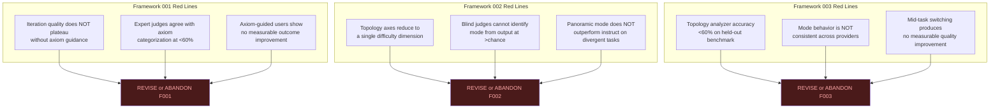
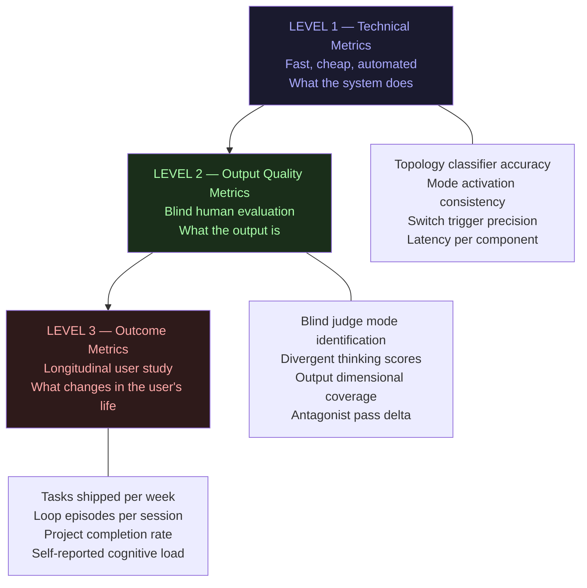
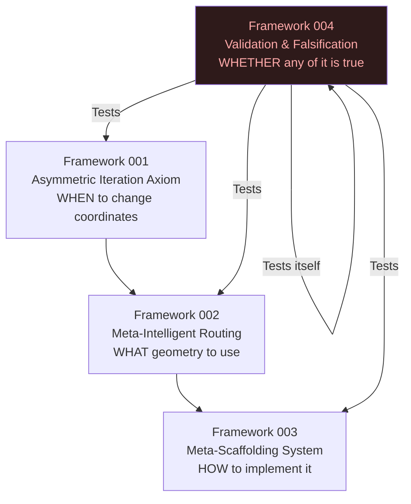

MD 004 iterapp... verify and falsify, the hard grounding...
# ITERAPP Framework 004

## The Validation & Falsification System

### *How We Know If Any of This Is True*

> *“A framework that cannot be falsified is not a framework. It is a belief system.”*
> — Popper (1959), adapted

> *“The measurement imbalance in agentic AI evaluation — where technical metrics dominate (83%) while human-centered outcomes remain peripheral (30%) — creates a fundamental disconnect between benchmark success and deployment value.”*
> — Stanford/arXiv, 2025

-----

## Preamble — Why This Framework Exists

Frameworks 001, 002, and 003 are coherent. They are theoretically grounded. They connect to real literature. They are internally consistent.

None of that means they are correct.

The Asymmetric Iteration Axiom could be a useful heuristic that breaks down at scale. The Panoramic Mode could produce outputs that feel categorially different but measure identically on outcomes that matter. The topology analyzer could classify tasks at 55% accuracy — barely better than random. The routing system could generate the subjective feeling of progress without producing more shipped work, more tangible results, or better cognitive outcomes for 2e users.

Framework 004 exists to find out which of these is true.

It is not an extension of the previous frameworks. It is their **adversary**. Its job is to break them.

-----

## Table of Contents

1. [What Must Be True For Each Framework To Be Valid](#1-what-must-be-true-for-each-framework-to-be-valid)
2. [Falsification Conditions — The Red Lines](#2-falsification-conditions--the-red-lines)
3. [Measurement Architecture](#3-measurement-architecture)
4. [The Benchmark Suite](#4-the-benchmark-suite)
5. [The 2e User Study Protocol](#5-the-2e-user-study-protocol)
6. [The Panoramic Mode Empirical Test](#6-the-panoramic-mode-empirical-test)
7. [The Topology Analyzer Accuracy Test](#7-the-topology-analyzer-accuracy-test)
8. [The Loop Detection Validity Test](#8-the-loop-detection-validity-test)
9. [What Good Results Look Like](#9-what-good-results-look-like)
10. [What Bad Results Look Like — And What To Do](#10-what-bad-results-look-like--and-what-to-do)
11. [The Meta-Validation Problem](#11-the-meta-validation-problem)
12. [Minimum Viable Validation for the Competition](#12-minimum-viable-validation-for-the-competition)

-----

## 1. What Must Be True For Each Framework To Be Valid

### Framework 001 — Asymmetric Iteration Axiom

**Core claim**: The decision to iterate has a real energetic cost, and that cost is asymmetric across dimensions. Applying the axiom produces better iteration decisions than not applying it.

**What must be empirically true**:

|Claim                                      |Testable Form                                                                                                                  |
|-------------------------------------------|-------------------------------------------------------------------------------------------------------------------------------|
|Energetic cost of iteration is real        |Users who iterate without threshold guidance show measurable quality plateau or regression after a predictable number of cycles|
|Omnidimensional check catches regressions  |Blind evaluation of iterations flagged as “reformulation” vs “iteration” by the axiom matches expert human judgment at >70%    |
|Applying the axiom produces better outcomes|Users guided by the axiom ship more, complete more, abandon less than control group                                            |

### Framework 002 — Meta-Intelligent Routing

**Core claim**: Task topology is a better routing signal than difficulty. Different cognitive modes produce categorially different outputs on the same task.

**What must be empirically true**:

|Claim                                                 |Testable Form                                                                                                           |
|------------------------------------------------------|------------------------------------------------------------------------------------------------------------------------|
|Topology axes are independent                         |PCA on topology vectors shows at least 3 independent factors, not a single difficulty factor                            |
|Mode outputs differ categorially                      |Blind human judges can identify which mode produced which output at >chance accuracy                                    |
|Panoramic mode outperforms instruct on divergent tasks|On Guilford-type divergent tasks, Panoramic Mode scores higher on originality/flexibility/fluency than standard instruct|
|Routing by topology outperforms routing by difficulty |Auto-routed outputs rated higher by blind judges than difficulty-routed outputs                                         |

### Framework 003 — Meta-Scaffolding System

**Core claim**: System prompt composition + sampling parameters + context strategy produces mode-specific behavior without model modification.

**What must be empirically true**:

|Claim                                     |Testable Form                                                                                                       |
|------------------------------------------|--------------------------------------------------------------------------------------------------------------------|
|System prompts reliably activate modes    |Same task + different mode configs produces outputs classifiable as different modes by blind judges at >70% accuracy|
|Topology analyzer achieves useful accuracy|Classifier accuracy >65% on held-out task benchmark (chance = 50% for binary axes)                                  |
|Mid-task switching improves output quality|Tasks with detected topology shifts that trigger mode switches rated higher than tasks where switch was suppressed  |
|Model-agnostic claim holds                |Mode behavior is consistent across at least 3 different model providers                                             |

-----

## 2. Falsification Conditions — The Red Lines

These are the results that would require partial or full abandonment of a framework. Stated in advance. Non-negotiable.



**Critical note**: Hitting a red line is not failure. It is the system working correctly. A framework that cannot be falsified is not a framework.

-----

## 3. Measurement Architecture

Three measurement levels, each catching what the others miss:



**The measurement imbalance trap**: Per Stanford/arXiv 2025, 83% of agentic AI evaluations use only technical metrics. ITERAPP explicitly commits to all three levels, weighted toward L3 — because L3 is the only level that answers whether any of this matters.

-----

## 4. The Benchmark Suite

### 4.1 Task Topology Benchmark (TTB-100)

100 tasks manually labeled by domain experts across all 7 topology axes. Used to evaluate the topology analyzer.

**Construction**:

```
TTB-100 Composition:
- 20 clearly convergent tasks (math proofs, code bugs, factual questions)
- 20 clearly divergent tasks (strategy, creative, cross-domain synthesis)
- 20 high-dimensional tasks (multi-stakeholder decisions, systems design)
- 20 high-emergence tasks (novel hypothesis generation, creative breakthroughs)
- 20 mixed/ambiguous tasks (the hard cases)

Labeling protocol:
- 3 independent expert raters per task
- Inter-rater reliability measured (Cohen's κ > 0.7 required)
- Disagreements resolved by discussion, not averaging
```

**Acceptance criterion**: Topology analyzer achieves >65% accuracy on held-out 20% of TTB-100.

### 4.2 Divergent Thinking Benchmark (DTB)

Adapted from LiveIdeaBench (Nature Communications, 2026) and Guilford’s Alternative Uses Task.

**Axes measured** (per LiveIdeaBench):

- **Originality** — statistical infrequency of response
- **Fluency** — number of valid responses
- **Flexibility** — number of distinct categories
- **Feasibility** — practical viability
- **Clarity** — coherence of expression

**Experimental design**:

```
Same 30 divergent tasks run through:
  A) Standard instruct (control)
  B) Panoramic Mode (treatment)
  C) Associative Mode (treatment)
  D) Extended Analytic (negative control — should underperform)

Blind evaluation by 3 judges per output.
Primary hypothesis: B > A on Originality and Flexibility.
Secondary hypothesis: D < A on Originality (confirms mode specificity).
```

### 4.3 Convergent Task Benchmark (CTB)

Standard reasoning benchmarks where extended analytical mode should win.

Tasks from: GSM8K, MATH500, logical deduction tasks.

**Primary hypothesis**: Extended Analytic Mode > Panoramic Mode on convergent tasks. If this is NOT true, the mode distinction is not real.

### 4.4 Mode Identification Benchmark (MIB)

**Protocol**:

- Run 50 tasks through all 4 primary modes
- Present outputs to blind judges with no context
- Judges must identify which mode produced each output
- Acceptance criterion: >65% correct identification (chance = 25% for 4 modes)

This is the most direct test of whether modes are real and distinct.

-----

## 5. The 2e User Study Protocol

The most important and most difficult test. Technical accuracy means nothing if 2e users don’t produce more tangible results.

### 5.1 Study Design

```
N = 30 self-identified 2e adults (ADHD + high ability, self-reported)
Duration = 4 weeks
Design = Crossover (each participant experiences both conditions)

Week 1-2: Control condition (standard LLM access, no routing)
Week 3-4: ITERAPP condition (full meta-scaffolding active)
OR
Week 1-2: ITERAPP condition
Week 3-4: Control condition
(randomized assignment)
```

### 5.2 Primary Outcome Metrics

**Tangible result metrics** (objective, not self-reported):

|Metric                   |Measurement Method                                      |Collection  |
|-------------------------|--------------------------------------------------------|------------|
|Tasks completed per week |User-defined task list, binary completion               |Weekly      |
|Projects shipped         |User-defined “shipped” threshold                        |End of study|
|Loop episodes per session|System-logged: same output structure ×3 with no progress|Automatic   |
|Session abandonment rate |Session ends without output marked complete             |Automatic   |

**Cognitive experience metrics** (self-reported, validated scales):

|Metric            |Scale                                           |Timing      |
|------------------|------------------------------------------------|------------|
|Cognitive load    |NASA-TLX (validated)                            |Post-session|
|Perceived progress|Custom 5-point scale                            |Daily       |
|Loop experience   |“Did you feel stuck today?” binary + description|Daily       |
|Frustration       |PANAS negative affect subscale                  |Weekly      |

### 5.3 What Would Constitute Evidence

**Strong positive evidence** (supports all three frameworks):

- Completed tasks/week: ITERAPP > Control by >20%
- Loop episodes: ITERAPP < Control by >30%
- NASA-TLX cognitive load: ITERAPP < Control (p < 0.05)

**Weak positive evidence** (supports with caveats):

- Any significant improvement on any single metric
- Qualitative reports of meaningfully different experience

**Null evidence** (requires framework revision):

- No significant difference on any objective metric
- Users cannot distinguish ITERAPP from standard LLM in exit survey

**Negative evidence** (requires framework revision or abandonment):

- Control outperforms ITERAPP on objective metrics
- ITERAPP increases cognitive load rather than reducing it

-----

## 6. The Panoramic Mode Empirical Test

This is the single most important technical test because Panoramic Mode is the most novel claim.

### 6.1 The Specific Claim

> Panoramic Mode (high temperature + no CoT + holistic context + specific system prompt) produces outputs that score higher on divergent thinking dimensions than standard instruct mode on the same model.

### 6.2 The Minimal Test — Runnable This Week

```python
"""
Minimum viable Panoramic Mode validation.
Requires: API access to any model.
Time: ~2 hours to run, ~4 hours to evaluate.
"""

DIVERGENT_TASKS = [
    "What are all the possible uses for a broken clock?",
    "How might the concept of 'debt' apply to non-financial systems?",
    "What would a city designed for ADHD brains look like?",
    "How is building a startup similar to debugging code?",
    "What does music theory have in common with urban planning?",
    # ... 25 more tasks
]

INSTRUCT_CONFIG = {
    "system": "You are a helpful assistant.",
    "temperature": 0.7,
    "top_p": 0.9,
}

PANORAMIC_CONFIG = {
    "system": """You are operating in PANORAMIC MODE.
Hold the entire problem space in view simultaneously.
Prioritize cross-domain connections and structural patterns.
Do NOT reason step-by-step. Do NOT narrow prematurely.
See the whole landscape before descending anywhere.""",
    "temperature": 0.92,
    "top_p": 0.97,
    "presence_penalty": 0.6,
}

# Run all tasks through both configs
# Blind evaluation by 3 judges on: Originality, Flexibility, Fluency
# Primary hypothesis: Panoramic > Instruct on Originality (p < 0.05)
```

### 6.3 What The Results Mean

|Result                                                 |Interpretation                                            |Action                              |
|-------------------------------------------------------|----------------------------------------------------------|------------------------------------|
|Panoramic significantly > Instruct on Originality      |Mode is real. Claim holds.                                |Proceed with confidence             |
|No significant difference                              |System prompt alone insufficient. Need different mechanism|Revise mode implementation          |
|Instruct > Panoramic                                   |Panoramic Mode as specified is counterproductive          |Abandon this specific implementation|
|Panoramic > Instruct on Flexibility but not Originality|Partial support                                           |Refine claim                        |

-----

## 7. The Topology Analyzer Accuracy Test

### 7.1 Evaluation Protocol

```python
def evaluate_topology_analyzer(analyzer, benchmark_tasks, ground_truth):
    """
    benchmark_tasks: list of task strings
    ground_truth: expert-labeled TopologyVectors
    """
    results = []
    for task, truth in zip(benchmark_tasks, ground_truth):
        predicted = analyzer.analyze(task)
        
        # Per-axis accuracy (continuous → binary by threshold)
        for axis in truth.__dataclass_fields__:
            pred_val = getattr(predicted, axis)
            true_val = getattr(truth, axis)
            
            # Binary: high (>0.6) vs low (<0.4) vs ambiguous
            pred_category = "high" if pred_val > 0.6 else "low" if pred_val < 0.4 else "ambiguous"
            true_category = "high" if true_val > 0.6 else "low" if true_val < 0.4 else "ambiguous"
            
            results.append({
                "axis": axis,
                "correct": pred_category == true_category,
                "task": task[:50]
            })
    
    # Per-axis accuracy
    for axis in TopologyVector.__dataclass_fields__:
        axis_results = [r for r in results if r["axis"] == axis]
        accuracy = sum(r["correct"] for r in axis_results) / len(axis_results)
        print(f"{axis}: {accuracy:.2%}")
    
    # Overall accuracy
    overall = sum(r["correct"] for r in results) / len(results)
    print(f"\nOverall: {overall:.2%}")
    print(f"Acceptance threshold: 65.00%")
    print(f"Pass: {overall >= 0.65}")
```

### 7.2 Stage 1 vs Stage 2 Comparison

A key sub-question: does the meta-prompt stage 2 actually improve on heuristic stage 1?

If Stage 2 adds <5% accuracy over Stage 1 on non-ambiguous tasks, it should be removed — it adds latency without proportional gain. Axiom applies to the system’s own components.

-----

## 8. The Loop Detection Validity Test

### 8.1 What Loop Detection Claims

The OutputMonitor claims to detect loops (recursion without progress) from linguistic signals in the output stream.

### 8.2 Validation Protocol

**Ground truth construction**: 50 synthetic sessions — 25 containing deliberate loops (same structure, no semantic progress), 25 containing genuine iterative deepening (same structure, clear semantic advancement).

**Test**: Does the OutputMonitor correctly classify these at >70%?

**The hard case**: Iterative deepening often looks like a loop from the outside — same structure, returning to the same point. The monitor must distinguish *spiral that descends* from *circle that returns*. This is the hardest problem in the system.

**If the monitor cannot distinguish these**: Loop detection must be redesigned. A false positive that triggers mode switch when the user is actually deepening productively is worse than no loop detection at all.

-----

## 9. What Good Results Look Like

A clear picture of what validates the system:

```mermaid
graph LR
    subgraph TECHNICAL
        T1[Topology analyzer >65% accuracy ✓]
        T2[Mode outputs identifiable >65% ✓]
        T3[Panoramic > Instruct on divergence ✓]
        T4[Mode behavior consistent across providers ✓]
    end

    subgraph OUTPUT_QUALITY
        O1[Blind judges rate routed outputs higher ✓]
        O2[Antagonist pass improves complex tasks ✓]
        O3[DTB scores: Panoramic > Instruct on Originality ✓]
    end

    subgraph USER_OUTCOMES
        U1[Completed tasks +20% in ITERAPP condition ✓]
        U2[Loop episodes -30% in ITERAPP condition ✓]
        U3[NASA-TLX cognitive load reduced ✓]
        U4[Users prefer ITERAPP in exit survey ✓]
    end

    TECHNICAL --> |Necessary but not sufficient| OUTPUT_QUALITY
    OUTPUT_QUALITY --> |Necessary but not sufficient| USER_OUTCOMES
    USER_OUTCOMES --> VALID[System Validated]
```



**Key insight from the measurement imbalance literature**: Technical metrics passing while user outcome metrics fail means the system is technically correct and practically useless. User outcomes are the terminal validation criterion.

-----

## 10. What Bad Results Look Like — And What To Do

|Failure Pattern                              |Diagnosis                                                     |Response                                                                                                             |
|---------------------------------------------|--------------------------------------------------------------|---------------------------------------------------------------------------------------------------------------------|
|Topology analyzer <60%                       |Feature extraction is too shallow                             |Add embedding-based classifier layer                                                                                 |
|Modes not identifiable                       |System prompts don’t produce distinct behavior                |Redesign mode configs, increase differentiation                                                                      |
|Panoramic = Instruct on divergence           |Temperature/prompt insufficient for true mode change          |Investigate whether true Panoramic requires architectural change beyond scaffolding                                  |
|Technical OK, output quality no different    |Routing is working but modes aren’t meaningfully different    |Question whether the mode taxonomy is real or constructed                                                            |
|Output quality OK, user outcomes no different|System produces better outputs that don’t change what users do|The bottleneck is not cognitive mode — it is something else (motivation, executive function, external accountability)|
|User outcomes worse                          |ITERAPP introduces friction that hurts more than it helps     |Radical UX simplification required                                                                                   |

### The Most Likely Failure Mode

Based on honest assessment: the most likely failure is **output quality OK, user outcomes no different**.

Why: ITERAPP optimizes the *quality* of the thinking environment. But 2e users’ bottleneck may not be thinking quality — it may be the gap between good thinking and execution. A better cognitive mode doesn’t automatically translate to shipped work.

If this failure occurs, the system needs a fourth component that has not been designed yet: **the execution bridge** — the mechanism that converts good cognitive output into committed action steps with external accountability.

This would be Framework 005. But we don’t build it until we know if we need it.

-----

## 11. The Meta-Validation Problem

There is a recursive problem this framework cannot escape:

**Framework 004 is itself a framework subject to its own logic.**

The validation criteria chosen here could be wrong. The benchmarks could measure the wrong things. The user study could have confounds. The blind evaluation protocol could have bias.

Two honest acknowledgments:

**Acknowledgment 1**: Framework 004 is not neutral. It was designed by the same mind that designed Frameworks 001-003. It may have blind spots that favor the frameworks it is testing. Independent replication by a party with no stake in the result is the only full solution.

**Acknowledgment 2**: The Gödelian incompleteness is real. No validation system can fully validate itself from within. The minimum requirement is that Framework 004’s falsification conditions are stated in advance and honored if they are met — which they are, and which is a commitment, not a claim.

-----

## 12. Minimum Viable Validation for the Competition

The full validation protocol above is a research program, not a competition demo. Here is what is achievable in the available time:

### What can be done now (1-2 days)

**Test 1 — Panoramic vs Instruct (2 hours to run)**

- 10 divergent tasks
- Both configs on same model
- 3 blind judges (can be peers)
- Score on Originality and Flexibility
- Report result honestly

**Test 2 — Mode Identification (1 hour)**

- 5 tasks × 4 modes = 20 outputs
- Ask 3 people to identify which mode produced which output
- Report accuracy

**Test 3 — Topology Analyzer (1 hour)**

- 20 tasks manually labeled by the builder
- Run through analyzer
- Report accuracy

### What honest reporting looks like

```
COMPETITION DEMO VALIDATION SECTION:

"We ran a preliminary validation of three core claims:

1. Panoramic Mode vs Instruct on 10 divergent tasks:
   Originality score: Panoramic 3.8/5 vs Instruct 3.1/5 (n=10, 3 judges)
   [or: No significant difference was found]

2. Mode identification: judges correctly identified mode
   from output in X/20 cases (X% vs 25% chance)

3. Topology analyzer accuracy: X% on 20 manually labeled tasks

These are preliminary results. Full validation requires
N=30 user study over 4 weeks, which we commit to conducting
post-competition. Falsification conditions are stated in
the Framework 004 document."
```

**This is what separates a credible system from a confident claim.**

The competition judges will have seen many confident claims. Honest preliminary results with explicit falsification conditions and a stated validation roadmap are rare — and memorable.

-----

## Summary: The Four Frameworks as a Complete System



**Framework 004 is not the conclusion of the system. It is the conscience of it.**

Without 004, ITERAPP is a well-structured hypothesis.

With 004 — run, honestly, with results reported regardless of outcome — ITERAPP becomes something rarer:

**A system that knows what it would take to prove itself wrong.**

-----

*ITERAPP Framework 004 — Validation & Falsification*
*The framework that earns the right to believe the other three.*
*From chaos to your peak — but only if the peak is real.*